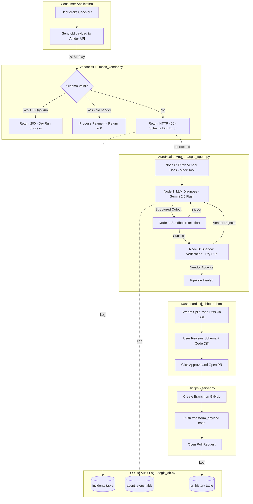

# AutoHeal.ai — Autonomous API Remediation Middleware

AutoHeal.ai is a self-healing API integration middleware that autonomously detects, diagnoses, and fixes schema drift errors at runtime. When a third-party API changes its schema overnight, AutoHeal.ai intercepts the HTTP 400 error, uses a LangGraph agent powered by Google Gemini to generate a Python transformation patch, tests it in a sandboxed environment, verifies it via dry-run shadow execution, and opens a GitHub Pull Request — all with zero downtime.

---

## Architecture



---

## Repository Structure

```
AutoHeal.ai/
├── README.md
├── requirements.txt         # Python dependencies
├── start.sh                 # Convenience script to start the stack
├── .gitignore
├── backend/
│   ├── aegis_agent.py       # LangGraph agent: 4-node state machine (fetch_docs → diagnose → sandbox → verify)
│   ├── aegis_db.py          # SQLite audit log module (incidents, agent_steps, pr_history tables)
│   ├── dashboard.html       # React control plane frontend (split-pane diff viewer, incident log)
│   ├── logic.md             # Agent behavior and workflow notes
│   ├── mock_vendor.py       # Mock third-party API with strict schema validation + dry-run support
│   ├── product_backend.py   # Consumer app simulator — catches 400 errors and delegates to the agent
│   ├── server.py            # FastAPI dashboard server, SSE telemetry stream, GitOps PR endpoint
│   ├── test_llm.py          # Quick Gemini API connectivity check
│   └── .env.example         # Template for environment secrets
└── frontend/
    ├── .gitignore           # Frontend-only ignore rules
    ├── index.html           # Vite entry document for the React app
    ├── package-lock.json    # Locked frontend dependency versions
    ├── package.json         # Frontend scripts and dependencies
    ├── vercel.json          # Vercel deployment configuration
    ├── vite.config.js       # Vite build and dev-server config
    ├── public/
    │   └── dashboard.html   # Static dashboard shell used by the frontend
    └── src/
        ├── App.jsx          # Root React component
        ├── index.css        # Global styles and layout tokens
        ├── main.jsx         # React bootstrap entry point
        ├── PaymentGateway.jsx # Payment workflow UI and API wiring
        └── ProductSelection.jsx # Product selection UI
```

---

## Setup Instructions

### Prerequisites

- **Python 3.10+**
- **Git**
- A [Google AI Studio](https://aistudio.google.com/apikey) API key (Gemini)
- A [GitHub Personal Access Token](https://github.com/settings/tokens) (for PR automation)

### 1. Clone and install

```bash
git clone https://github.com/Sanjay-Sunil/AutoHeal.ai.git
cd AutoHeal.ai
```

Create and activate a virtual environment:

```bash
# Windows
python -m venv venv
.\venv\Scripts\activate

# macOS / Linux
python3 -m venv venv
source venv/bin/activate
```

Install dependencies:

```bash
pip install -r requirements.txt
```

### 2. Configure environment

Copy the example env file and fill in your keys:

```bash
cp backend/.env.example backend/.env
```

Edit `backend/.env`:

```env
GEMINI_API_KEY="your-gemini-api-key"
GITHUB_TOKEN="your-github-personal-access-token"
GITHUB_REPO_NAME="your-username/your-target-repo"
```

| Variable | Required | Purpose |
|----------|----------|---------|
| `GEMINI_API_KEY` | **Yes** | Powers the LLM diagnosis and code generation |
| `GITHUB_TOKEN` | For PRs | Enables the "Approve & Open PR" GitOps feature |
| `GITHUB_REPO_NAME` | For PRs | Target repository for automated pull requests |

### 3. Run the system

You need **two terminals** running simultaneously:

**Terminal 1 — Mock Vendor API** (port 8000):
```bash
python backend/mock_vendor.py
```

**Terminal 2 — Dashboard Server** (port 8001):
```bash
cd backend
python server.py
```

### 4. Open the dashboard

Navigate to **http://127.0.0.1:8001/** in your browser.

---

## MVP Demo

The following sequence of images demonstrates AutoHeal.ai in action, from detecting an API failure in a mock SaaS application to autonomously generating and proposing a fix.

### 1. The Consumer Application (Mock SaaS)

The user interacts with our mock SaaS dashboard, preparing to make a payment.


When the user navigates to the payment gateway, everything appears normal.


However, when the user attempts to process the payment, a sudden HTTP 400 Schema Drift Error occurs. This happens because the vendor API schema has changed unexpectedly without our knowledge.


### 2. AutoHeal.ai Interception and Diagnosis

Behind the scenes, AutoHeal.ai intercepts this failure. Here is the dashboard server before the error occurs, monitoring the system:


Once the HTTP 400 error is caught, the LangGraph agent powered by LLM immediately steps in to diagnose the drift. It fetches the new vendor OpenAPI documentation and analyzes the differences.


### 3. Autonomous Patch Generation and Review

AutoHeal.ai successfully identifies the schema mismatch. It generates a detailed report outlining the exact difference between the old and new schemas, streaming the findings to the dashboard for maintainer review.


Alongside the schema diff, it also provides the required code changes (`transform_payload` function) to heal the integration. The system halts and waits for the maintainer to verify the dry-run results and approve the code changes.


### 4. GitOps Workflow: PR Creation

The maintainer reviews the changes in the dashboard and clicks "Approve & Open PR". AutoHeal.ai automatically creates a new branch and pushes a Pull Request to the GitHub repository containing the fix.


### 5. Seamless Recovery

With the PR merged and the new code deployed, the consumer application successfully processes the payment. The integration is healed with zero downtime for the end user!


---

## How It Works

### Step-by-step flow

1. **Click "Checkout & Pay"** — triggers a simulated API call with a deprecated payload (`{user_id, amount}`).
2. **HTTP 400 intercepted** — the mock vendor rejects it because it now expects `{transaction: {total_amount, user_uuid}}`.
3. **LangGraph agent activates** — a 4-node state machine runs autonomously:
   - **Node 0 (Tool):** Fetches vendor OpenAPI documentation
   - **Node 1 (LLM):** Gemini 2.5 Flash diagnoses the drift and generates a `transform_payload()` function with structured output (old/new schemas + old/new code)
   - **Node 2 (Sandbox):** Executes the generated code in a restricted Python scope
   - **Node 3 (Verify):** Replays the healed payload to the vendor via dry-run (`X-Dry-Run: true` + `Idempotency-Key`)
4. **Dashboard updates in real-time** via Server-Sent Events (SSE) — split-pane Schema Diff and Code Diff viewers.
5. **Click "Approve & Open PR"** — creates a GitHub branch and opens a Pull Request with the fix.

### Key features

| Feature | Description |
|---------|-------------|
| **Structured LLM Output** | Pydantic-enforced response: `reasoning`, `old_schema`, `new_schema`, `old_code`, `new_code` |
| **Shadow Verification** | Dry-run replay with idempotency headers — zero side effects |
| **Stack Trace Introspection** | Dynamically identifies the source file that initiated the API call via `traceback.extract_stack()` |
| **SQLite Audit Log** | Every incident, agent step, and PR is logged to `aegis_audit.db` |
| **Auto-Retry with Backoff** | Exponential backoff on Gemini 429 rate limits (up to 5 retries) |
| **Split-Pane Diff Dashboard** | Side-by-side schema and code comparison with syntax highlighting |

---

## API Endpoints

| Method | Endpoint | Description |
|--------|----------|-------------|
| `GET` | `/` | Serves the dashboard UI |
| `GET` | `/api/checkout-stream` | SSE stream of the full remediation workflow |
| `POST` | `/api/approve-pr` | Creates a GitHub branch and opens a PR with the generated patch |
| `GET` | `/api/incidents` | Lists recent incidents from the audit log |
| `GET` | `/api/incidents/{id}` | Full detail for a single incident (steps + PR history) |

---

## Tech Stack

- **Agent Framework:** [LangGraph](https://github.com/langchain-ai/langgraph) (state machine orchestration)
- **LLM:** [Google Gemini 2.5 Flash](https://ai.google.dev/) via LangChain
- **Backend:** [FastAPI](https://fastapi.tiangolo.com/) + Uvicorn
- **Frontend:** React 18 (CDN) + Tailwind CSS + Prism.js (syntax highlighting)
- **Database:** SQLite (local audit log)
- **GitOps:** [PyGithub](https://pygithub.readthedocs.io/) for branch/PR creation

---

## License

MIT
